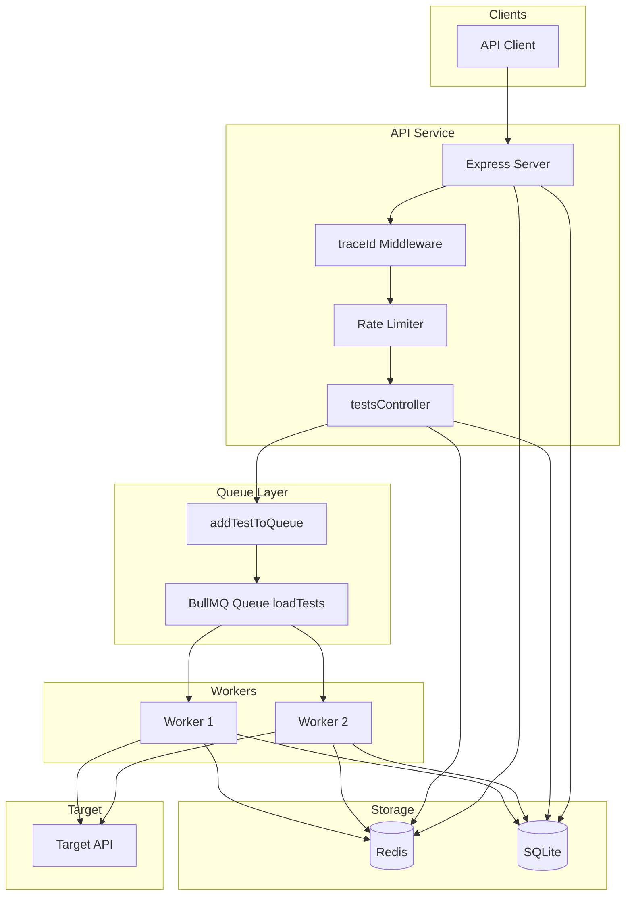
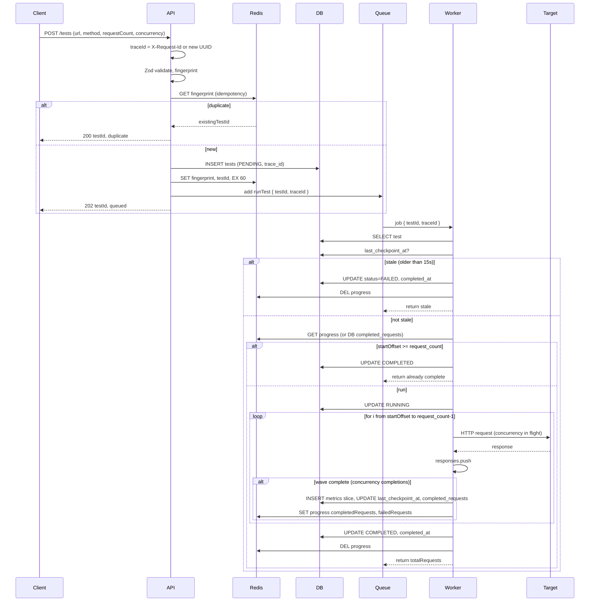

# Distributed Load Testing Platform

## Table of Contents

- [Overview](#overview)  
- [Tech Stack](#tech-stack) 
- [Assumptions and Architectural Notes](#assumptions-and-architectural-notes) 
- [Setup](#setup)  
  - [Running Locally](#running-locally)  
  - [Using Docker Compose](#using-docker-compose)  
- [API Endpoints](#api-endpoints)  
  - [POST /tests](#post-tests)  
  - [GET /tests/:id](#get-testsid)  
  - [GET /tests](#get-tests)  
- [Scaling and Production Considerations](#scaling-and-production-considerations)  
- [Edge Cases and Recovery](#edge-cases-and-recovery)  


## Overview

This system allows multiple users to submit concurrent load tests against target APIs. Each test can execute thousands of requests with controlled concurrency. Results are persisted for analysis.

Key features:
- Idempotent test submission (avoids duplicate tests on retry)
- Real-time progress tracking
- Checkpoint and resume: progress persisted every concurrency-sized wave; worker resumes from last offset if re-queued
- Asynchronous execution
- Filtering of tests by method, URL, error rate, throughput
- Recovery of orphaned RUNNING tests (re-queued on worker startup)
- Leader-lock mechanism so only one worker runs recovery

### System architecture



### Request and job flow



## Tech Stack

- Node.js + TypeScript  
- Express.js for API  
- BullMQ + Redis for job queue and progress tracking  
- SQLite for persistent storage  
- Axios + axios-retry for HTTP requests  
- Zod for request validation  


## Assumptions and Architectural Notes

- **Scope:** HTTP APIs only; users are authorized to load test targets; rate limiting/abuse handled externally.
- **Storage:** SQLite for demo scale; production would need a scalable DB. Redis (progress, queue, leader lock) and SQLite (tests, metrics) use Docker volumes for durability.
- **Execution:** At-least-once semantics; each test enforces its own concurrency; idempotent submission and checkpoint/resume avoid duplicate runs and enable recovery.
- **Design:** Request-level metrics in DB for debugging; BullMQ for async execution and horizontal scaling; Redis for progress and leader lock; `restart: unless-stopped` plus orphan recovery for automatic recovery.


## Directory Structure
Project code is stored under src folder

```bash
.
├── src
  ├── api
  │   ├── controllers
  │   │   └── testsController.ts
  │   ├── routes
  │   │   └── tests.ts
  │   └── server.ts
  ├── infra
  │   ├── db.ts
  │   └── redis.ts
  ├── middleware
  │   └── traceId.ts
  ├── queue
  │   └── testQueue.ts
  ├── schemas
  │   └── loadTestSchema.ts
  ├── types
  │   └── db.ts
  ├── utils
  │   ├── axios.ts
  │   ├── env.ts
  │   ├── errorResponse.ts
  │   ├── fingerprint.ts
  │   ├── json.ts
  │   ├── metricsAggregation.ts
  │   ├── rateLimiter.ts
  │   └── recovery.ts
  └── workers
      └── worker.ts
```


## Setup

### Prerequisites

- Node.js 20+
- npm (or yarn/pnpm)
- Local Redis server available on port `6379`
- For Docker: Docker and Docker Compose

### Configuration (environment variables)

Scaling and capacity knobs (optional; defaults work for local/demo):

| Variable | Default | Description |
|----------|---------|-------------|
| `LOADTEST_MAX_REQUEST_COUNT` | 100000 | Max `requestCount` per test (schema validation). |
| `LOADTEST_MAX_CONCURRENCY` | 1000 | Max `concurrency` (in-flight requests) per test (schema validation). |
| `WORKER_CONCURRENCY` | 2 | Number of jobs this worker process runs at once (BullMQ). Total concurrent tests = worker replicas × `WORKER_CONCURRENCY`. |
| `REDIS_HOST` | 127.0.0.1 | Redis host. |
| `REDIS_PORT` | 6379 | Redis port. |
| `PORT` | 3000 | API server port. |
| `SQLITE_FILE` | ./data/loadtests.db | SQLite database path. In Docker, set to `/app/data/loadtests.db` in `.env`; the named volume `sqlite-data` is mounted at `/app/data`. |

Example: to run 100+ tests at once with 10 worker replicas, set `WORKER_CONCURRENCY=10` (10 × 10 = 100 concurrent jobs).

### Running Locally

1. Install dependencies:
```bash
npm install
```

2. Start the API server:
```bash
npm run dev
```

3. Start one or more worker instances in separate terminals:
```bash
npm run worker
```

### Using Docker Compose

1. Build and start all services (API, 2 workers, Redis):
```bash
docker compose up --build --scale worker=2
```

2. Services included:
- `api` → Express server on port 3000
- `worker` → two worker instances
- `redis` → Redis with persistence

3. **Data persistence:** SQLite and Redis use Docker **named volumes** (`sqlite-data` and `redis-data`). The DB file is at `/app/data/loadtests.db` inside the API and worker containers (set via `SQLITE_FILE` in `.env`). The project's `./data` folder on the host is **not** used by Docker. To start with a completely fresh DB and Redis (e.g. no old tests or jobs), run `docker compose down -v` then `docker compose up --build`.


## API Endpoints

### POST `/tests`

Submit a load test. This endpoint is idempotent — if the same user submits the same test
configuration within a short window, the existing test is returned instead of creating
a new one.

**cURL:**
```bash
curl -X POST http://localhost:3000/tests \
  -H "Content-Type: application/json" \
  -d '{
    "url": "https://jsonplaceholder.typicode.com/todos/1",
    "method": "GET",
    "headers": {},
    "payload": {},
    "requestCount": 1000,
    "concurrency": 50
  }'
```

**Responses:**
- `202 Accepted` → A new test was created and queued
- `200 OK` → Duplicate submission detected, existing testId returned

**Response Body:**
```json
{
  "testId":"da98a342-81a1-4df8-b9ac-f0411865088c",
  "message":"Test queued successfully"
}
```

### GET `/tests/:id`

Fetch the status and results of a specific load test.

cURL:
```bash
curl http://localhost:3000/tests/<testId>
```


**Response (Running):**
```json
{
  "testId": "uuid",
  "status": "RUNNING",
  "progress": {
    "totalRequests": 1000,
    "completedRequests": 500,
    "failedRequests": 12
  },
  "createdAt": "2024-01-01T10:00:00.000Z",
  "completedAt": null
}
```


**Response (Completed):**
```json
{
  "testId": "uuid",
  "status": "COMPLETED",
  "metrics": {
    "totalRequests": 1000,
    "successRate": 98.4,
    "errorRate": 1.6,
    "avgResponseMs": 120,
    "throughput": 82.3
  },
  "createdAt": "2024-01-01T10:00:00.000Z",
  "completedAt": "2024-01-01T10:02:30.000Z"
}
```

**Response (Failed):** 
Test marked FAILED (e.g. stale: last checkpoint &gt; 15s ago). Same base fields as above with `status: "FAILED"` and `completedAt` set. Aggregated metrics may be present for partial runs.

### GET `/tests`

List all load tests with optional filters.

cURL:
```bash
curl "http://localhost:3000/tests?method=GET&minErrorRate=30"
```

**Query Parameters:**

- `method` → HTTP method (GET, POST, etc.)
- `url` → Target URL
- `minErrorRate, maxErrorRate` → Error rate bounds
- `minThroughput, maxThroughput` → Throughput bounds (requests/sec)

**Response Body:**
```json
[
  {
    "testId": "uuid",
    "url": "https://example.com/api",
    "method": "GET",
    "status": "COMPLETED",
    "errorRate": 12.5,
    "throughput": 80.2,
    "createdAt": "2024-01-01T10:00:00.000Z",
    "completedAt": "2024-01-01T10:02:30.000Z"
  }
]
```


## Scaling and Production Considerations

### Fault Tolerance and Recovery (Implemented)

The system already includes multiple mechanisms to handle failures and restarts:

- BullMQ ensures jobs are not lost if a worker crashes mid-execution
- Test state is persisted in the database, enabling recovery after service restarts
- A leader-lock mechanism ensures only one worker performs recovery at a time
- Orphaned tests are detected and re-queued only when the queue is empty, avoiding duplicate execution
- Multiple worker instances can safely consume from the same queue
- Checkpoint and resume: progress and metrics are written every concurrency-sized wave; workers resume from Redis or DB `completed_requests` when a job is retried or re-queued.
- Staleness: if the last checkpoint is older than 15 seconds, the worker marks the test FAILED and does not run, avoiding resuming invalid or stale runs after long outages.

These mechanisms allow the system to recover from API restarts, worker crashes, or temporary Redis interruptions without manual intervention.

### Avoiding idle resource wastage

To avoid over-provisioning workers when the queue is empty:

- **Scale workers by queue depth:** Don’t run a fixed large number of workers. Scale worker count (or total job slots) up when the queue has many jobs and **down when the queue is empty or low**. Use queue depth (e.g. BullMQ/Redis waiting + active job count) as the scaling signal.
- **Kubernetes + KEDA:** In production, run workers on Kubernetes and use [KEDA](https://keda.sh/) (Kubernetes Event-driven Autoscaling) to scale worker replicas based on queue depth. KEDA can scale to zero or a minimum when the queue is empty and scale out when many tests are submitted. This avoids idle resource wastage while still supporting 100+ concurrent tests when load is high.
- **Worker-level concurrency:** Use the `WORKER_CONCURRENCY` env var so each worker process can run multiple jobs. Then fewer replicas are needed for the same throughput (e.g. 10 replicas × `WORKER_CONCURRENCY=10` = 100 concurrent tests), and scaling steps are finer.

### Further production improvements

- **Bounds:** Configurable via `LOADTEST_MAX_REQUEST_COUNT` and `LOADTEST_MAX_CONCURRENCY` (defaults 100000 and 1000). Axios timeout 10s. Consider per-user quotas and stricter limits.
- **Scaling:** Run workers across processes/machines; Redis clustering; time-series or stream-based metrics ingestion; PostgreSQL + connection pooling.
- **Observability:** Prometheus/Grafana; structured logging with trace IDs; queue depth and error rate metrics.
- **Security:** Auth on endpoints; scope tests by user/org; validate and sanitize headers/payloads.


## Edge Cases and Recovery

### Idempotent Submissions

Within a short window, identical submissions (same user and params) return the existing test ID instead of creating a duplicate, avoiding load amplification on retries.

### Optional Headers and Payloads

Headers and payload are optional; JSON and form-encoded payloads are supported via `Content-Type`.

### Worker Failures During Test Execution

- If a worker crashes while executing a test, BullMQ keeps the job (retry or another worker picks it up).
- Progress is checkpointed every concurrency-sized wave (metrics to DB, progress to Redis, `last_checkpoint_at` and `completed_requests` to DB). So partial progress is persisted.
- When another worker (or retry) picks up the job, it resumes from the last checkpoint (Redis or DB). If the job is picked up more than 15 seconds after the last checkpoint, the worker marks the test **FAILED** (staleness) and does not run.

### Orphaned Test Recovery

- Orphaned tests are tests with `status = 'RUNNING'` in the database but no active (or waiting) job in the queue (e.g. workers died, queue was lost).
- On worker startup, a recovery process runs: one worker acquires a Redis leader lock (`loadtest:recovery:leader`). If the queue is idle (no waiting or active jobs), that worker re-queues one job per orphaned test with `testId` and `traceId` (job name `runTest`).
- When a worker picks up a re-queued job, it **does not** blindly run: it applies a **staleness check**. If `last_checkpoint_at` is older than 15 seconds, the test is marked **FAILED** and the job returns without running. Otherwise, the worker **resumes** from the last checkpoint (Redis or DB `completed_requests`). So recovery re-queues; the worker decides run vs fail and resume vs start from 0.

### Multiple Workers and Concurrency

- Multiple worker instances can consume from the same queue concurrently.
- BullMQ guarantees that a single test job is processed by only one worker at a time.
- Leader-lock ensures recovery logic is executed by only one worker even when multiple workers start simultaneously.

### Redis or Service Restarts

- Redis restarts may clear progress keys. Resume falls back to DB `completed_requests` and `last_checkpoint_at`. If both Redis and DB have no resume point, the worker starts from 0.
- Staleness uses DB `last_checkpoint_at`; if it is older than 15s after a long Redis outage, the worker marks the test FAILED when the job is processed.
- API and worker restarts do not require manual intervention; recovery runs on worker startup and re-queues orphaned RUNNING tests.

### Graceful Shutdown

- Workers stop accepting new jobs on shutdown.
- In-progress jobs are either completed or safely retried by BullMQ.
- Redis and database connections are closed cleanly to avoid corruption.

### Known Limitations

- Progress (completedRequests/failedRequests) for RUNNING tests is read from Redis; if Redis is down, GET /tests/:id may show 0,0 until the next checkpoint.
- Request-level metrics increase DB write volume; per-wave writes are used to support resume; aggregation-only or time-series storage is recommended for very large production usage.
- Staleness threshold is fixed at 15 seconds (10s request timeout + buffer); not configurable via env in the current implementation.
- Recovery runs only on worker startup and only when the queue is idle; prolonged Redis unavailability may delay re-queuing until workers restart and Redis is back.

## Runbooks: Recovery and Failure Modes

### Orphaned tests (RUNNING but no active job)

**Symptoms:** Tests stuck in `RUNNING`; no worker is processing them (e.g. workers restarted, queue was cleared).

**Recovery (automatic):**
1. On startup, one worker acquires the leader lock in Redis (`loadtest:recovery:leader`, TTL 30s).
2. If the queue has no waiting or active jobs, that worker selects all tests with `status = 'RUNNING'` and re-queues one job per test with `{ testId, traceId }` (job name `runTest`).
3. Any worker that picks up such a job then:
   - If `last_checkpoint_at` is older than 15s → mark test **FAILED**, do not run.
   - Else resume from Redis or DB `completed_requests` and continue to completion.

**Manual check:** Query DB for `status = 'RUNNING'`; check queue depth (e.g. BullMQ dashboard or Redis). Ensure at least one worker is running so recovery can run on next startup.

---

### Worker crash mid-test

**Symptoms:** A worker process dies while a test is RUNNING.

**Behavior:**
- BullMQ retries the job or another worker picks it up.
- The worker loads the test, reads resume point from Redis (or DB `completed_requests`), and continues from the last checkpoint. Progress and metrics are already persisted per wave.
- If the job is picked up more than 15s after the last checkpoint, the worker marks the test FAILED (staleness).

**Action:** None required if workers are running; recovery and resume handle it. If no worker picks up the job, restart workers so recovery runs and re-queues the test.

---

### Redis unavailable or restarted

**Symptoms:** API or workers cannot connect to Redis; progress keys may be lost after restart.

**Behavior:**
- Resume falls back to DB `completed_requests` and `last_checkpoint_at`. If Redis progress is missing, the worker resumes from DB if available, else from 0.
- Staleness still uses DB `last_checkpoint_at`: if it’s older than 15s, the worker marks the test FAILED.
- GET /tests/:id progress for RUNNING tests reads Redis; if Redis is down, progress may show 0,0 until the next checkpoint.

**Action:** Restore Redis; restart API and workers. Orphaned RUNNING tests will be re-queued on worker startup; workers will resume or mark FAILED based on staleness.

---

### API or worker won’t start (Redis/DB not ready)

**Symptoms:** Connection errors to Redis or SQLite on startup.

**Action:**
- Ensure Redis is up and reachable (e.g. `redis-cli ping`).
- For Docker, ensure `api` and `worker` depend on `redis` and that Redis has finished starting; use healthchecks or wait scripts if needed.
- For SQLite, ensure the DB path is writable. Locally this is usually `./data/loadtests.db`. In Docker, the DB lives in the named volume `sqlite-data` at `/app/data`; ensure the volume is not read-only.

---

### Test stuck in PENDING

**Symptoms:** Test never moves to RUNNING.

**Checks:** Ensure at least one worker is running and connected to the same Redis/queue. Check queue name (`loadTests`) and job name (`runTest`). Inspect worker logs for errors. If the queue was flushed, run recovery by restarting workers so orphaned RUNNING tests are re-queued; PENDING tests are only picked up when a job exists (submit creates the job).

---

### Health check fails (503)

**Endpoint:** `GET /health` returns 503 if Redis ping or DB check fails.

**Action:** Fix Redis or DB connectivity; ensure volumes and network are correct in Docker. Check logs for `initRedis` / `initDb` or connection errors.

